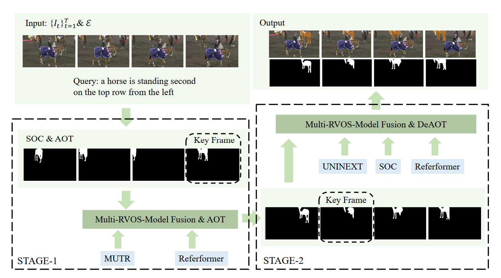

# ICCV2023: The 5th Large-scale Video Object Segmentation Challenge
## 1st place solution for track three: Referring Video Object Segmentation Challenge.

[Zhuoyan Luo<sup>*1</sup>](https://github.com/RoberLuo1), [Yicheng Xiao<sup>*1</sup>](https://github.com/EasonXiao-888), [Yong Liu<sup>*12</sup>](https://workforai.github.io/), Yitong Wang<sup>2</sup>, Yansong Tang<sup>1</sup>, Xiu Li<sup>1</sup>, Yujiu Yang<sup>1</sup>

<sup>1</sup> Tsinghua Shenzhen International Graduate School, Tsinghua University <sup>2</sup> ByteDance Inc.

<sup>*</sup> Equal Contribution

😊😊😊 [Paper](https://youtube-vos.org/assets/challenge/2023/reports/RVOS_1st.pdf)
## 📢 Updates:
- [x] We Release the Code for the The 5th Large-scale Video Object Segmentation Challenge.

## 📖 Abstract
The recent transformer-based models have dominated the Referring Video Object Segmentation (RVOS) task due to the superior performance. Most prior works adopt unified DETR framework to generate segmentation masks in query-to-instance manner. In this work, we integrate
strengths of that leading RVOS models to build up an effective paradigm. We first obtain binary mask sequences from the RVOS models. To improve the consistency and quality
of masks, we propose Two-Stage Multi-Model Fusion strategy. Each stage rationally ensembles RVOS models based on framework design as well as training strategy, and leverages different video object segmentation (VOS) models to enhance mask coherence by object propagation mechanism. Our method achieves 75.7% J &F on Ref-Youtube-VOS validation set and 70% J &F on test set, which ranks 1st place on 5th Large-scale Video Object Segmentation Challenge (ICCV 2023) track 3

## 📗 FrameWork
<p align="center">

</p>

## 🛠️ Environment Setup
As we use different RVOS models, we need to set up two version of environment.
### First Environment (for SOC MUTR Referformer AOT DEAOT)
 - install pytorch `pip install torch==1.11.0+cu113 torchvision==0.12.0+cu113 torchaudio==0.11.0 --extra-index-url https://download.pytorch.org/whl/cu113`
 - install other dependencies
  `pip install h5py opencv-python protobuf av einops ruamel.yaml timm joblib pandas matplotlib cython scipy` 
 - install transformers
 `pip install transformers`
 - install pycocotools
 `pip install -U 'git+https://github.com/cocodataset/cocoapi.git#subdirectory=PythonAPI'`
 - install Pytorch Correlation (Recommend to install from [source](https://github.com/ClementPinard/Pytorch-Correlation-extension) instead of using `pip`)
 - build up MultiScaleDeformableAttention
    ```
    cd soc_test/models/ops
    python setup.py build install
    ``` 
### Second Environment (for UNINEXT)
 - The environmet please refer to [INSTALL.md](UNINEXT/assets/INSTALL.md) for more details
 - Follow each step to build up the environment

## Data Preparation
The Overall data preparation is set as followed.
We put rvosdata under the path /mnt/data_16TB/lzy23/rvosdata please change to xxx/rvosdata
```
rvosdata
└── refer_youtube_vos/ 
    ├── train/
    │   ├── JPEGImages/
    │   │   └── */ (video folders)
    │   │       └── *.jpg (frame image files) 
    │   └── Annotations/
    │       └── */ (video folders)
    │           └── *.png (mask annotation files) 
    ├── valid/
    │   └── JPEGImages/
    │       └── */ (video folders)
    │           └── *.jpg (frame image files)
    ├── test/
    │   └── JPEGImages/
    │       └── */ (video folders)
    │           └── *.jpg (frame image files) 
    └── meta_expressions/
        ├── train/
        │   └── meta_expressions.json  (text annotations)
        └── valid/
            └── meta_expressions.json  (text annotations)
```
**UNINEXT** needs to generate the extra valid.json and test.json for inference and please refer to [DATA.md/Ref-Youtube-VOS](UNINEXT/assets/DATA.md)

## Pretrained Model Preparation
We create a folder for storing all pretrained model and put them in the path
/mnt/data_16TB/lzy23/pretrained, please change to xxx/pretrained
```
pretrained
└── pretrained_swin_transformer
└── pretrained_roberta
└── bert-base-uncased
```
- for pretrained_swin_transformer folder
download [Video-Swin-Base](https://github.com/SwinTransformer/storage/releases/download/v1.0.4/swin_base_patch244_window877_kinetics400_22k.pth)
- for pretrained_roberta folder
download config.json pytorch_model.bin tokenizer.json vocab.json from huggingface (roberta-base)
- for bert-base-uncased folder
```
wget -c https://huggingface.co/bert-base-uncased/resolve/main/config.json
wget -c https://huggingface.co/bert-base-uncased/resolve/main/vocab.txt
wget -c https://huggingface.co/bert-base-uncased/resolve/main/pytorch_model.bin
```
or download from huggingface

## Model_Zoo
The Checkpoint we use are listed as follow: 
best organized that each model (backbone) corresponds to a folder.
| Model | Backbone   | Checkpoint |
|-------|------------| ---------- |
| SOC   | Video-Swin-Base | [Model](https://drive.google.com/file/d/1EVmywK8cjH5kpgpyV8NKfx1tiuPeUQA9/view?usp=drive_link)     |
| MUTR  | Video-Swin-Base | [Model](https://drive.google.com/file/d/11poAYPbJDB2R_DlsDhRrSYvgOzaihpTN/view?usp=sharing) | 
| Referformer_ft |  Video-Swin-Base | [Model](https://drive.google.com/file/d/18a96TEj8yY3Nb0Xf5WFLKmxPaazaFQ02/view?usp=sharing) |
| UNINEXT| VIT-H |[Model](https://maildluteducn-my.sharepoint.com/:f:/g/personal/yan_bin_mail_dlut_edu_cn/Eoe3Z5YAwi1Mj5gL_jJnXcEBuMnxPEM9yWtjE-pERp6mkg?e=rFbyVi) |
| UNINEXT | Convnext | [Model](https://maildluteducn-my.sharepoint.com/:f:/g/personal/yan_bin_mail_dlut_edu_cn/EiVn7fSMVq9CroNvMIbosUsBhNpLNn7E0tmLqJlDL6xcoQ?e=u6YUNu) |
| AOT | Swin-L | [Model](https://drive.google.com/file/d/13Fq7DhQETxCRPkU53ggLSWYn4-qrPz8V/view?usp=sharing) |
|DEAOT| Swin-L | [Model](https://drive.google.com/file/d/1dy-4jfMrK4CCGGIoLLIWWtYqoWOtD0bz/view?usp=drive_link) |

## 🚀 Training
We joint train the model SOC
### Output_dir
Generally we put all output under the dir, Specifically, we set /mnt/data_16TB/lzy23 as the output dir, so, please change it to xxx/.

if you want to joint train SOC, run the scripts ./soc_test/train_joint.sh. Before that, you need to change the path according to your path: 
- ./soc_test/configs/refer_youtube.yaml (file)
    - text_encoder_type (change /mnt/data_16TB/lzy23 to xxx) the follow is the same
- ./soc_test/datasets/refer_youtube_vos/
    - dataset_path (variable name)
    - line 164
- ./soc_test/utils.py
    - line 23
- ./soc_test/train_joint.sh
    - line 3 

## 🚀 Testing
First, We need to use the checkpoint mentioned above to inference to get the Annotations.

SOC

change the test_encoder path in ./soc_test/configs/refer_youtube_vos.yaml line 77
- run the scripts ./soc_test/scripts/infer_refytb.sh to get the Annotations and key_frame.json and need to change the path.
    - **Path Changed (/mnt/data_16TB/lzy23/ -> xxx/)**
    - ./soc_test/infer_refytb.py
        - line 56 68
    - ./soc_test/scripts/infer_refytb.sh
        - line 3 4
- run the scripts ./soc_test/scripts/infer_ensemble_test.sh to get masks.pth for following ensemble
    - **Path Changed (/mnt/data_16TB/lzy23/ -> xxx/)**
    - ./soc_test/infer_refyrb_ensemble.py
        - line 46 54
    - ./soc_test/scripts/infer_ensemble_test.sh
        - line 2 3


MUTR

Before start change the text_encoder path (/mnt/data_16TB/lzy23/ -> xxx/) in ./MUTR/models/mutr.py line 127
- run the scripts ./MUTR/inference_ytvos.sh to obtain the Annotations
    - **Path Changed (/mnt/data_16TB/lzy23/ -> xxx/)**
    - ./MUTR/inference_ytvos.sh
        - line 4 5 6
- run the scripts ./MUTR/infer_ytvos_ensemble.sh to obtain mask.pth
    - **Path Changed (/mnt/data_16TB/lzy23/ -> xxx/)**
    - ./MUTR/infer_ytvos_ensemble.sh
        - line 4 5 6
run the command to generate the key_frame.json (change the path ptf.py line 7 9 10)
```
python3 ./MUTR/ptf.py
```


Referformer

Before start change the text_encoder path (/mnt/data_16TB/lzy23/ -> xxx/) in ./Referformer/models/referformer.py line 127

- run the scripts ./Referformer/infer_ytvos.sh to obtain the Annotations
    - **Path Changed (/mnt/data_16TB/lzy23/ -> xxx/)**
    - ./Referformer/inference_ytvos.py 
        - line 59
    - ./Referformer/infer_ytvos.sh
        - line 3 4
- run the scripts ./Referformer/scripts/ensemble_for_test.sh
    - **Path Changed (/mnt/data_16TB/lzy23/ -> xxx/)**
    - ./Referformer/ensemble_for_test.sh
        - line 5 9 10
run the command to generate the key_frame.json (change the path ptf.py line 7 9 10)
```
python3 ./Referformer/ptf.py
```

UNINEXT 
We adopt two different backbones as our RVOS models, so follow the step to get the Annotations and mask.pth
First change the text encoder in (/mnt/data_16TB/lzy23/ -> xxx/)
- ./UNINEXT/projects/UNINEXT/uninext/models/deformable_detr/bert_model.py line 17 19  
- ./UNINEXT/projects/UNINEXT/uninext/data/dataset_mapper_ytbvis.py line 172
- ./UNINEXT/projects/UNINEXT/uninext/uninext_vid.py line 151
Second change the image_root and annotations_path ./UNINEXT/projects/UNINEXT/uninext/data/datasets/ytvis.py line 382 383 


1. VIT-H
- run the scripts ./UNINEXT/assets/infer_huge_rvos.sh
    - **Path Changed (/mnt/data_16TB/lzy23/ -> xxx/)**
    - ./UNINEXT/projects/UNINEXT/configs/video_joint_vit_huge.yaml
        - line 4 51
    - ./UNINEXT/detectron2/evaluation/evaluator.py
        - line 209 save_path
run the command to generate the key_frame.json (change the path vit_ptf.py line 7 9 10)
```
python3 ./UNINEXT/vit_ptf.py
```

2. Convnext
- run the scripts ./UNINEXT/assets/infer_huge_rvos.sh
    - **Path Changed (/mnt/data_16TB/lzy23/ -> xxx/)**
    - ./UNINEXT/projects/UNINEXT/configs/video_joint_convnext_large.yaml
        - line 4 51
    - ./UNINEXT/detectron2/evaluation/evaluator.py
        - make sure that you change /mnt/data_16TB/lzy23/test/model_pth/vit_huge.pth to xxx/test/model_pth/**convnext.pth**
run the command to generate the key_frame.json (change the path vit_ptf.py line 7 9 10)
```
python3 ./UNINEXT/convnext_ptf.py
```

After generating all Annotations, the results should be in the following format
```
test
└── soc/
    ├── Annotations
    ├── key_frame.json
└── mutr/
    ├── Annotations
    ├── key_frame.json
└── referformer_ft/
    ├── Annotations
    ├── key_frame.json
└── vit-huge/
    ├── Annotations
    ├── key_frame.json
└── convnext/
    ├── Annotations
    ├── key_frame.json
└── model_pth/
    ├── soc.pth
    ├── mutr.pth
    ├── referformer_ft.pth
    ├── vit_huge.pth
    ├── convnext.pth
```

Then as the pth is quite huge it is hard to load them in memory at a time, so run the following command to generate the split pth change the path in line 5 6
```
python3 split_pth.py
```

#### Post-Processing
We adopt AOT and DEAOT to post-process the mask results.

1. AOT

First, change the model_pth path in 
- ./rvos_competition/soc_test/AOT/configs/default.py line 88 112 128 129
then run the following command
```
cd ./soc_test/AOT
bash eval_soc.sh
bash eval_mutr.sh
bash eval_referformer_ft.sh
```
if you have more GPU resources you can change the variable gpunum in the sh file.
2. DEAOT

change the model_pth path in 
- ./rvos_competition/soc_test/DEAOT/configs/default.py line 88 112 128 129
then run the following command
```
cd ./soc_test/DEAOT
bash eval_vith.sh
bash eval_convnext.sh
bash eval_referformer_ft.sh
```

#### First Round Ensemble
We first fuse three models. Remember to generate all annotations mentioned above.
run the command below 

Remember to change the path in the sh file test_swap_1.sh test_swap_2.sh line 2 3
```
cd ./soc_test/scripts
bash test_swap_1.sh
bash test_swap_2.sh
```

After we use AOT and DEOAT to post-process respectively
run the scripts ./soc_test/AOT/eval_soc_mutr_referft.sh
run the scripts ./soc_test/DEAOT/eval_vit_convext_soc.sh

### Second Ensemble
First make sure that before doing the second ensemble, the format should be like 
```
test
└── soc/
    ├── Annotations
    ├── key_frame.json
    ├── Annotations_AOT_class_index
└── mutr/
    ├── Annotations
    ├── key_frame.json
    ├── Annotations_AOT_class_index
└── referformer_ft/
    ├── Annotations
    ├── key_frame.json
    ├── Annotations_AOT_class_index
    ├── Annotations_DEAOT_class_index
└── vit-huge/
    ├── Annotations
    ├── key_frame.json
    ├── Annotations_DEAOT_class_index
└── convnext/
    ├── Annotations
    ├── key_frame.json
    ├── Annotations_DEAOT_class_index
└── soc_mutr_referft/
    ├── Annotations
    ├── key_frame.json
    ├── Annotations_AOT_class_index
└── vit_convnext_soc/
    ├── Annotations
    ├── key_frame.json
    ├── Annotations_DEAOT_class_index
└── model_pth/
    ├── soc.pth
    ├── mutr.pth
    ├── referformer_ft.pth
    ├── vit_huge.pth
    ├── convnext.pth
└── model_split/
    ├── soc
        ├── soc0.pth 
        ├── xxx
    ├── mutr
        ├── mutr0.pth 
        ├── xxx
    ├── referformer_ft.pth
        ├── referformer_ft0.pth 
    ├── vit_huge.pth
        ├── vit_huge0.pth 
    ├── convnext.pth
        ├── convnext0.pth 
```

we will conduct two round ensemble.

1. run the scripts ./soc_test/scripts/test_ensemble_1.sh
change the path in sh file (line 1 2 3) to get the en2 Annotations.

2. run the scripts ./soc_test/scripts/test_ensemble_2.sh
also change the path in sh file (line 1 2 3) to get the final Annotations.

**Finally the Annotations in second_ensemble folder and named vit_convnext_soc_deaot_vitdeaot_en2_referftdeaot is the submission**

The Following table is the Annotations mentioned above

| Model | Annotations |
| ------| ----------- |
| SOC | [Oirgin](https://drive.google.com/file/d/1ler3rgHt6wnKw0N083WnAbjW976-EIFr/view?usp=drive_link) [AOT](https://drive.google.com/file/d/1trGNTTGIkfOzTcWIKdZi8R81SsNTNFbf/view?usp=drive_link)     |
| MUTR | [Oirgin](https://drive.google.com/file/d/1J9AZMZu8kK-6RhdbdhZStimsnpWX-nmN/view?usp=drive_link) [AOT](https://drive.google.com/file/d/1Icu8mKi4RjppWTZYI18iyHpgRpQgIP41/view?usp=drive_link)    |
| Referformer | [Oirgin](https://drive.google.com/file/d/1YFywl66feFpD6MrojZsvQ1ofkGdUUHHq/view?usp=drive_link) [AOT](https://drive.google.com/file/d/1-6-Yh6vxklefiLSwc_MrtMQsxNnWDgye/view?usp=drive_link) [DEAOT](https://drive.google.com/file/d/1cOCAFX-Oaw7yZMpvceJGUWkcTptCeG1-/view?usp=drive_link) |
| Vit-Huge |  [Oirgin](https://drive.google.com/file/d/1zeiyUXnxDSLcQmm6kdz5vZ9ykWSrSp51/view?usp=drive_link) [DEAOT](https://drive.google.com/file/d/1RBzyu1EhQnHC8mRWHVp3KLJGTZnsNg1X/view?usp=drive_link) | 
| Convnext |  [Oirgin](https://drive.google.com/file/d/1vKbQXkeW8_IZ1n5DI7j5MOyEXIANX6iy/view?usp=drive_link) [DEAOT](https://drive.google.com/file/d/1YRMu1cvI2tCfp5i1fkUoa1LBZPdNcQDs/view?usp=drive_link) | 
|soc_mutr_referft | [Oirgin](https://drive.google.com/file/d/1Ha9w3oF8VKR6sKCLsssULbdhHH0z3yKm/view?usp=drive_link) [AOT](https://drive.google.com/file/d/1h-9bGVECy0bUDSdWmOn4R3f0jyD4Shpp/view?usp=drive_link) |
|vit_convnext_soc | [Oirgin](https://drive.google.com/file/d/1cBmlUbuTFgOvrG0QUYMWle1kyRe6gcZF/view?usp=drive_link) [DEAOT](https://drive.google.com/file/d/1CU-4L-griG9f88HhSef8fiRvJlQyIdWN/view?usp=drive_link) |
|en2 | [Annotations](https://drive.google.com/file/d/1nTspxx9UvQ6c19Eg32Ttk5kdwL8kS1Po/view?usp=drive_link) |
|Final | [Annotations](https://drive.google.com/file/d/1En8nkItO0duDT5EEZTGdFnsOnXRRfj6O/view?usp=drive_link) |

## Acknowledgement
Code in this repository is built upon several public repositories. Thanks for the wonderful works.

If you find this work useful for your research, please cite:
```
@article{SOC,
  author       = {Zhuoyan Luo and
                  Yicheng Xiao and
                  Yong Liu and
                  Shuyan Li and
                  Yitong Wang and
                  Yansong Tang and
                  Xiu Li and
                  Yujiu Yang},
  title        = {{SOC:} Semantic-Assisted Object Cluster for Referring Video Object
                  Segmentation},
  journal      = {CoRR},
  volume       = {abs/2305.17011},
  year         = {2023},
}
```
 
 


    


